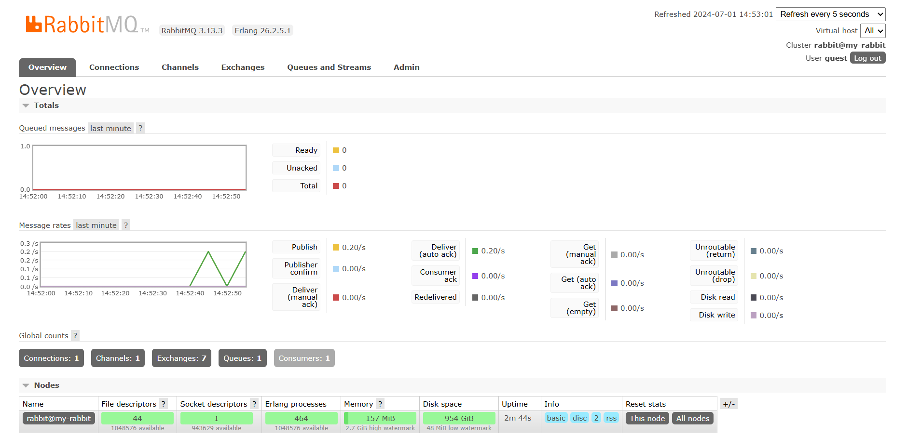
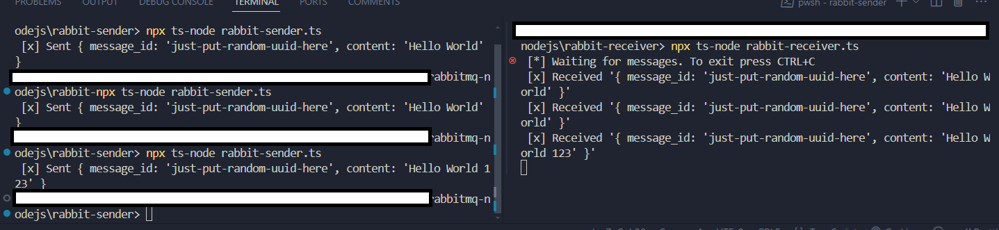

# RabbitMQ and Node.js Message Broker Example


This project demonstrates a simple implementation of RabbitMQ with Node.js to illustrate how message brokers work.



## 🚀 Overview

Message brokers like RabbitMQ facilitate communication between applications by enabling asynchronous messaging. This project showcases a basic scenario where messages are exchanged between a producer and a consumer using RabbitMQ.

## 🛠️ Prerequisites

Before running this project, ensure you have the following installed:

- [Node.js](https://nodejs.org/) (version >= 12.0.0)
- [RabbitMQ](https://www.rabbitmq.com/download.html) server

## 📋 Setup

1. **Clone the repository:**

   ```bash
   git clone https://github.com/yourusername/rabbitmq-nodejs-example.git
   cd rabbitmq-nodejs
2. **Change Directory To Sender And Receiver**

    To Sender
    ```bash
    cd rabbit-sender
    ```
  
    To Receiver
    ```bash
    cd rabbit-receiver
    ```
3. **Install Dependencies**
    ```bash
    npm intstall
    ```
4. **Start The RabbitMQ Server**

   Ensure RabbitMQ is running. You can download it from [RabbitMQ](https://www.rabbitmq.com/docs/download) and follow their installation instructions.
5. **Excute Sender And Receiver**

    Sender Command:
    ```bash
    npx ts-node rabbit-sender.ts
    ```

    Receiver Command:
   ```bash
   npx ts-node rabbit-receiver.ts
   ```
## 🏆 Result


